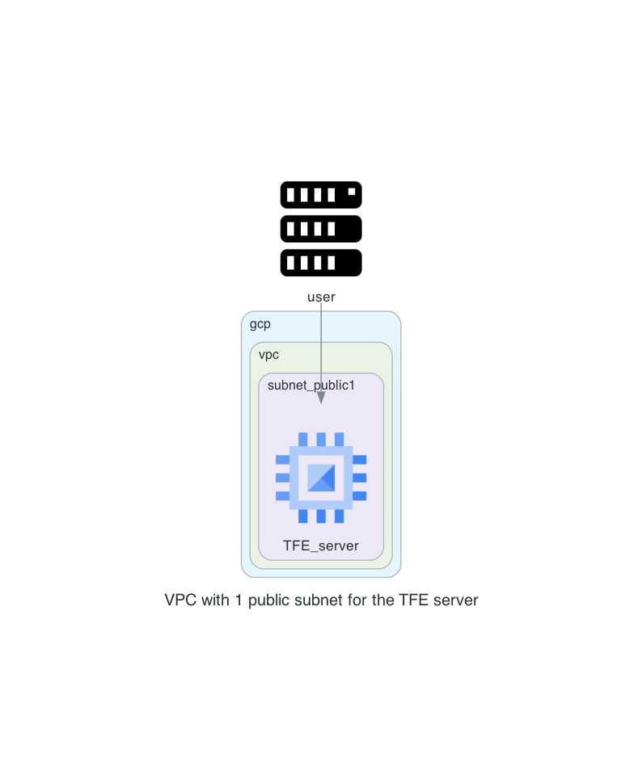

# Terraform Enterprise FDO - Mounted disk on Google Cloud Platform

This is a repository to have a TFE FDO mounted disk environment on GCP. 

# Diagram

  

# Prerequisites

## License
Make sure you have a TFE license available for use

## GCP

Have your GCP credentials configured

## AWS

This repository uses AWS resources for the DNS resources and creating the records

## Install terraform  
See the following documentation [How to install Terraform](https://learn.hashicorp.com/tutorials/terraform/install-cli)

## TLS certificate
You need to have valid TLS certificates that can be used with the DNS name you will be using to contact the TFE instance.  
  
The repo assumes you have no certificates and want to create them using Let's Encrypt and that your DNS domain is managed under AWS. 

# How to

- Clone the repository to your local machine
```sh
git clone https://github.com/munnep/tfe_fdo_gcp_mounted_disk.git
```
- Go to the directory  
```sh
cd tfe_fdo_gcp_mounted_disk
```
- Add your gcp authentication key as `key.json`
- create a file called `variables.auto.tfvars` with the following contents and your own values
```
# General
tag_prefix        = "tfe22"                       # TAG prefix for names to easily find your AWS resources
dns_hostname      = "tfe22"                       # DNS hostname for the TFE
dns_zonename      = "aws.munnep.com"              # DNS zone name to be used
tfe_release       = "v202312-1"                   # Version number for the release to install. This must have a value
tfe_password      = "Password#1"                  # TFE password for the dashboard and encryption of the data
public_key        = "ssh-rsa AAAAB3NzaN"          # The public key for you to connect to the server over SSH
certificate_email = "patrick.munne@hashicorp.com" # Your email address used by TLS certificate 
tfe_license       = "02MV4UU43BK5HGYYTOJZ"        # license file being used
# AWS
aws_region        = "eu-north-1"              # AWS region creating the DNS records
# gcp
gcp_region        = "eu-north-1"                  # GCP region creating the resources
vnet_cidr         = "10.214.0.0/16"               # Network to be used
gcp_project       = "hc-ff9323d13b0e4e0daee434a8171"
```
- Terraform initialize
```
terraform init
```
- Terraform plan
```
terraform plan
```
- Terraform apply
```
terraform apply
```
- Terraform output should create 16 resources and show you the public dns string you can use to connect to the TFE instance
```
Apply complete! Resources: 16 added, 0 changed, 0 destroyed.

Outputs:

ssh_tfe_server = "ssh ubuntu@tfe23.aws.munnep.com"
tfe_appplication = "https://tfe23.aws.munnep.com"
tfe_instance_public_ip = "34.32.208.215"
```
- You can now login to the application with the username `admin` and password specified in your variables.

# TODO

# DONE
- [x] build network according to the diagram
- [x] use standard ubuntu 
- [x] Create the disks where TFE should store it's data to be attached to the virtual machine
- [x] create a virtual machine in a public network with public IP address.
    - [x] firewall inbound are all from user building external ip
    - [x] firewall outbound rules
          user building external ip
- [x] create an elastic IP to attach to the instance
- [x] Create a valid certificate to use 
- [x] point dns name to public ip address
- [x] install TFE


